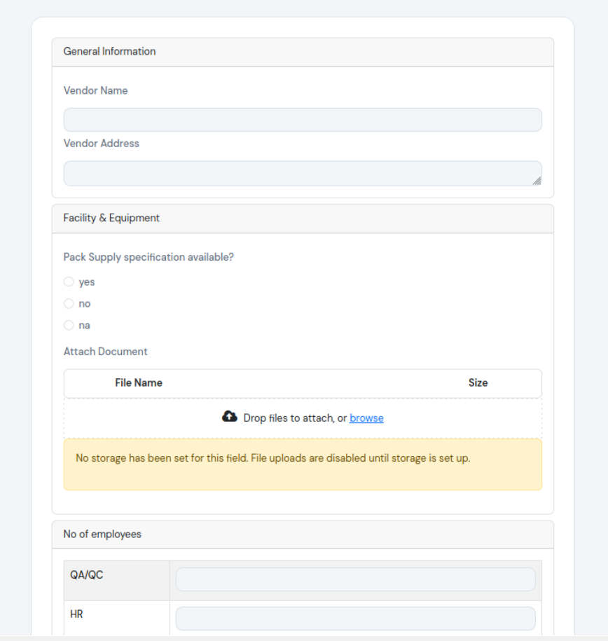
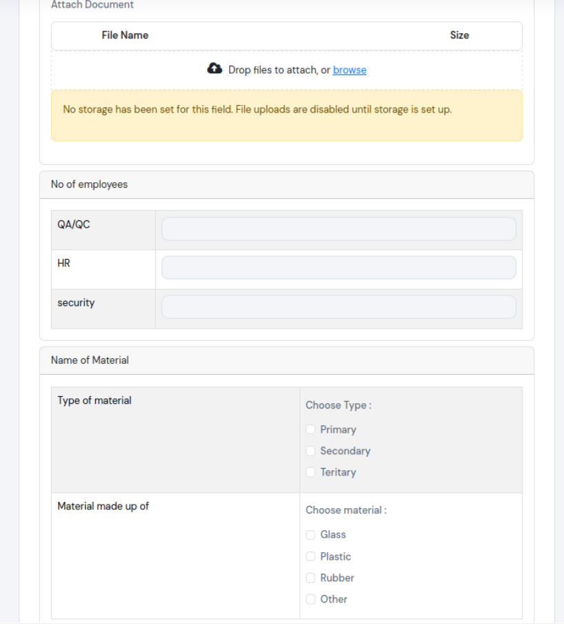
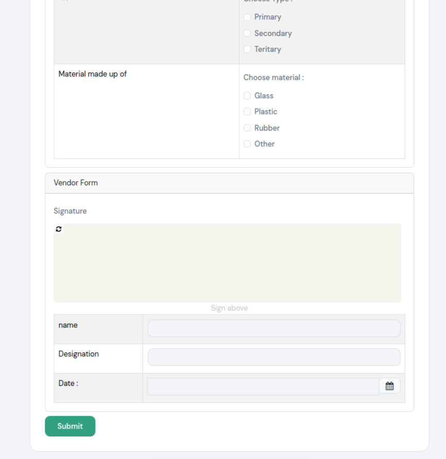

# FormIO Dynamic Forms — React

A powerful drag-and-drop form builder using `@formio/react` with proper field name resolution, built-in validation, and seamless data handling.

## 📝 Overview

This application provides a complete form management solution with three key components:

- **Admin Form Builder**: Drag-and-drop interface to create and configure forms
- **User Form Renderer**: Beautiful, responsive form display with built-in validation
- **Response Viewer**: View and manage form submissions

## ✨ Features

- 🎨 Drag-and-drop form builder with real-time preview
- ✅ Built-in validation and conditional field logic
- 📋 Support for multiple field types (text, select, checkbox, file upload, etc.)
- 🔄 Seamless data resolution from raw submission data
- 📊 Response viewer for tracking submissions
- 💾 JSON schema-based form configuration
- 🚀 Fast development with Vite + React 18

## 🚀 Quick Start

### Installation

```bash
npm install
```

### Development

```bash
npm run dev
```

Open [http://localhost:5173](http://localhost:5173) in your browser.

### Build for Production

```bash
npm run build
```

## 📦 Tech Stack

- **@formio/react** — FormBuilder (admin, drag-and-drop) + Form (user renderer)
- **@formio/js** — Core FormIO engine (peer dependency)
- **Vite** — Fast build tool and dev server
- **React 18** — UI library

## 📸 Screenshots

### 1. Form 1 — Admin Form Builder



_Drag-and-drop interface for creating powerful forms with 15+ field types, conditional logic (show/hide fields based on other inputs), and comprehensive validation rules._

### 2. Form 2 — User Form with Multiple Input Types



_Responsive form renderer with diverse input fields including text, email, phone, number, textarea, radio buttons, select dropdowns, checkboxes, date/time pickers, file upload, and data grids (tables with dynamic rows for bulk data entry)._

### 3. Form 3 — Rich Submissions with Signature & Advanced Fields



_View and manage form submissions with support for signature pads, data grids, panels, tabs, file uploads, and all rich field types with human-readable labels and formatted values._

## 🔧 Architecture

### Admin Builder (`AdminBuilder.jsx`)

- Uses `<FormBuilder>` from `@formio/react`
- Allows admins to drag fields, configure labels, options, and validation rules
- Clicking **Publish** saves the JSON schema for later use

### User Form (`UserForm.jsx`)

- Uses `<Form>` from `@formio/react`
- Receives the JSON schema and renders a fully working form
- Includes built-in validation, conditional fields, file uploads, data grids, etc.

### Response Viewer (`ResponseViewer.jsx`)

- Displays submitted form data
- Shows human-readable field names and values
- Resolves option labels from schema configuration

## 📊 Field Name Resolution (`utils/resolveAnswers.js`)

FormIO submission data structure:

```json
{
  "data": {
    "fullName": "John Doe",
    "department": "engineering"
  }
}
```

`resolveAnswers()` function maps:

- `fullName` → "Full Name" (from schema label)
- `"engineering"` → "Engineering" (from option label in schema)
- Complex data → Human-readable format

### Production Pattern

Raw submission data is stored in the database, while the app layer transforms it to human-readable output:

```sql
-- Store raw submission data
INSERT INTO form_responses (form_id, answers)
VALUES (1, '{"fullName":"John","department":"engineering",...}');

-- Resolve on read in application
const fields = resolveAnswers(schema.components, row.answers);
```

## 📂 Project Structure

```
src/
├── components/
│   ├── AdminBuilder.jsx      # Form builder interface
│   ├── UserForm.jsx          # Form renderer for end users
│   └── ResponseViewer.jsx    # Submission viewer
├── utils/
│   └── resolveAnswers.js     # Field name resolution logic
├── App.jsx                   # Main application component
├── main.jsx                  # React entry point
└── styles.css                # Application styles

screenshots/
├── form-1.png
├── form-2.png
└── form-3.png
```

## 🛠️ Development Tips

1. **Adding Screenshots**: Place screenshots in the `screenshots/` folder and update the paths above
2. **Debugging Forms**: Use browser DevTools to inspect FormIO schema and submission data
3. **Custom Validation**: Extend validation rules in the FormBuilder settings
4. **API Integration**: Connect UserForm submissions to your backend for data persistence

## 📄 License

MIT

## Field types supported (via formio)

- Text field, Email, Phone, Number, Password
- Textarea
- Radio, Select, Selectboxes (multi-select), Checkbox
- Date/Time, Day
- File upload
- DataGrid (table with dynamic rows)
- Signature pad
- Columns, Panel, Fieldset, Tabs
- Conditional visibility (show field when another = value)
- Built-in validation (required, min/max, regex, custom)
